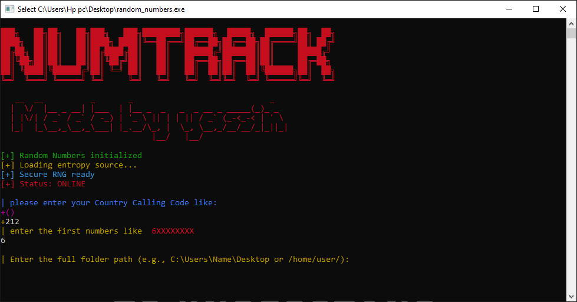

# Country_random_numbers

This Windows tool makes 40,000.00 random numbers in most times within 15-14s in a `.txt` file.

You can choose which country calling code you want like:
* `+(31)`
* `+(212)`

And you can also choose the first numbers like:
* `06XXXXXXXX`
* `07XXXXXXXX`

## Project Screenshot

